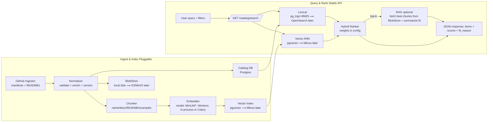

# Matrix Hub

**Matrix Hub** is a lightweight, production‑grade catalog and installer service for AI agents, tools, and MCP servers.  
It ingests manifests from remote catalogs (e.g., GitHub), provides **search** (lexical + semantic, hybrid‑ranked), computes and executes **install plans** (pip/uv, docker, git, zip), and optionally **registers** tools/servers with an MCP Gateway.

- **API:** FastAPI on port **7300**
- **DB:** PostgreSQL (SQLite supported for limited local use)
- **Ingest:** Pull `index.json` from remote(s), validate manifests, (optionally) chunk+embed content
- **Install:** Safe, idempotent steps + project adapters + lockfile generation
- **Auth:** Optional bearer token for admin routes
- **Logs:** Structured JSON with correlation IDs

---


## Quick start (docker compose)

Requirements: Docker 24+, docker compose plugin.

```bash
# 1) Clone and enter the repo
git clone https://github.com/agent-matrix/matrix-hub.git
cd matrix-hub

# 2) Create .env from template and adjust if needed
cp .env.example .env
# (Optionally) set MATRIX_REMOTES to your catalog index.json URLs in .env

# 3) Build & run
docker compose up -d --build

# 4) Health check
curl -s http://localhost:7300/health | jq
```
You should see:

```json
{ "status": "ok" }
```
The app container waits for Postgres to be healthy, then starts the API. Ingest is scheduled (see INGEST_INTERVAL_MIN in .env).

## Architecture




## Environment

All configuration is via environment variables; see `.env.example` for a documented template.

Key settings (common):

| Variable                    | Purpose                                         | Example                                                                 |
| :-------------------------- | :---------------------------------------------- | :---------------------------------------------------------------------- |
| `DATABASE_URL`              | SQLAlchemy URL                                  | `postgresql+psycopg://matrix:matrix@db:5432/matrixhub`                  |
| `HOST` / `PORT`             | Bind address/port                               | `0.0.0.0` / `7300`                                                      |
| `MATRIX_REMOTES`            | CSV/JSON list of `index.json` URLs to ingest    | `https://raw.githubusercontent.com/agent-matrix/catalog/main/index.json`|
| `INGEST_INTERVAL_MIN`       | Background ingest interval (minutes)            | `15`                                                                    |
| `API_TOKEN`                 | Bearer token for admin/protected endpoints      | `set_me`                                                                |
| `MCP_GATEWAY_URL`           | MCP Gateway base URL                            | `http://mcpgateway:7200`                                                |
| `MCP_GATEWAY_TOKEN`         | Bearer for Gateway admin API                    | `supersecret`                                                           |
| `SEARCH_LEXICAL_BACKEND`    | `pgtrgm` or `none`                              | `pgtrgm`                                                                |
| `SEARCH_VECTOR_BACKEND`     | `pgvector` / `none`                             | `none`                                                                  |
| `SEARCH_HYBRID_WEIGHTS`     | `sem:0.6,lex:0.4,rec:0.1,q:0.1`                 |                                                                         |
| `RAG_ENABLED`               | `false`                                         |                                                                         |
| `EMBED_MODEL`               | Embedder identifier (informational)             | `sentence-transformers/all-MiniLM-L6-v2`                                |

**Security:** If you set `API_TOKEN`, pass `Authorization: Bearer <token>` on protected endpoints (e.g., manual ingest). Without it, admin endpoints are disabled or open depending on route configuration.

## API walk‑through

Base URL defaults to `http://localhost:7300`.

### GET /health

Liveness/readiness. Optional DB probe:

```bash
curl -s 'http://localhost:7300/health?check_db=true' | jq
```
Returns:

```json
{ "status": "ok", "db": "ok" }
```

### GET /catalog/search

Hybrid search over the catalog with optional filters.

**Query params**

* `q` (required) — free text query
* `type` — `agent` | `tool` | `mcp_server`
* `capabilities` — CSV, e.g. `pdf,summarize`
* `frameworks` — CSV, e.g. `langgraph,watsonx_orchestrate`
* `providers` — CSV, e.g. `openai,watsonx`
* `mode` — `keyword` | `semantic` | `hybrid` (default from settings)
* `limit` — default `20`
* `with_rag` — `true` to enrich results with a short “fit_reason”
* `rerank` — `none` | `llm` (default from settings)

**Example**

```bash
curl -s 'http://localhost:7300/catalog/search?q=summarize%20pdfs&type=agent&capabilities=pdf,summarize&limit=5&with_rag=true' | jq
```
**Response (truncated)**

```json
{
  "items": [
    {
      "id": "agent:pdf-summarizer@1.4.2",
      "type": "agent",
      "name": "PDF Summarizer",
      "version": "1.4.2",
      "summary": "Summarizes long PDF documents into concise points.",
      "capabilities": ["pdf", "summarize"],
      "frameworks": ["langgraph"],
      "providers": ["watsonx"],
      "score_lexical": 0.82,
      "score_semantic": 0.76,
      "score_quality": 0.9,
      "score_recency": 0.88,
      "score_final": 0.83,
      "fit_reason": "Matches 'summarize pdfs'; strong README snippet about legal contracts."
    }
  ],
  "total": 1
}
```

### GET /catalog/entities/{id}

Fetch full entity details for a specific catalog ID.

**Example**

```bash
curl -s 'http://localhost:7300/catalog/entities/agent:pdf-summarizer@1.4.2' | jq
```

### POST /catalog/install

Compute and execute an install plan (pip/uv, docker, git, zip), write adapters into your project, and (optionally) register tools/servers with MCP‑Gateway. Emits `matrix.lock.json`.

**Body**

```json
{
  "id": "agent:pdf-summarizer@1.4.2",
  "target": "./apps/pdf-bot"
}
```

**Example**

```bash
curl -s -X POST 'http://localhost:7300/catalog/install' \
  -H 'Content-Type: application/json' \
  -d '{"id":"agent:pdf-summarizer@1.4.2","target":"./apps/pdf-bot"}' | jq
```
**Response (truncated)**

```json
{
  "plan": {
    "artifacts": [
      {"kind": "pypi", "command": "uv pip install --system --no-cache-dir pdf-summarizer-agent==1.4.2"}
    ],
    "adapters": [{"framework":"langgraph","template_key":"langgraph-node"}],
    "mcp_registration": {
      "tool": { "name": "pdf_summarize", "integration_type": "REST", "request_type": "POST", "url": "http://..." }
    }
  },
  "results": [
    {"step":"pypi","ok":true,"returncode":0,"elapsed_secs":5.91},
    {"step":"adapters.write","ok":true,"extra":{"count":1}},
    {"step":"gateway.register","ok":true,"extra":{"tool":{"id":"...","name":"pdf_summarize"}}},
    {"step":"lockfile.write","ok":true,"extra":{"path":"apps/pdf-bot/matrix.lock.json"}}
  ],
  "files_written": ["apps/pdf-bot/src/flows/pdf_summarizer_node.py","apps/pdf-bot/matrix.lock.json"],
  "lockfile": { "version":1, "entities":[{ "id":"agent:pdf-summarizer@1.4.2", "...": "..." }] }
}
```
Note: MCP server registration maps to the Gateway’s `/gateways` endpoint automatically via the internal client.

## Manifests & Schemas

Catalog authors publish manifests in a separate content repo (e.g., `agent-matrix/catalog`) and generate an `index.json`.

Matrix Hub ingests those manifests on a schedule or via an admin trigger.
Supported schemas (JSON Schema Draft 2020‑12):

* Agent: `schemas/agent.manifest.schema.json`
* Tool:  `schemas/tool.manifest.schema.json`
* MCP Server: `schemas/mcp-server.manifest.schema.json`

Minimal `index.json` formats accepted:

```json
{ "manifests": ["https://.../agents/pdf/1.4.2/agent.manifest.yaml"] }
```
or

```json
{ "items": [ {"manifest_url": "https://.../tool.manifest.yaml"} ] }
```
or

```json
{ "entries": [ {"base_url": "[https://raw.githubusercontent.com/ORG/REPO/main/](https://raw.githubusercontent.com/ORG/REPO/main/)", "path": "agents/pdf/1.4.2/agent.manifest.yaml"} ] }
```
Example agent manifest (excerpt):

```yaml
schema_version: 1
type: agent
id: pdf-summarizer
name: PDF Summarizer
version: 1.4.2
description: Summarizes long PDF documents into concise points.
capabilities: [pdf, summarize]
compatibility:
  frameworks: [langgraph]
  providers: [watsonx]
artifacts:
  - kind: pypi
    spec: { package: pdf-summarizer-agent, version: "==1.4.2" }
adapters:
  - framework: langgraph
    template_key: langgraph-node
mcp_registration:
  tool:
    name: pdf_summarize
    integration_type: REST
    request_type: POST
    url: [https://example.com/invoke](https://example.com/invoke)
    input_schema: { type: object, properties: { input: { type: string } }, required: [input] }
```

## Local development

```bash
# 1) Create a virtualenv (optional)
python3 -m venv .venv && source .venv/bin/activate

# 2) Install in editable mode
pip install -U pip
pip install -e .

# 3) Run with auto-reload
make dev
# or
uvicorn src.app:app --reload --port 7300
```
**Quality & tests**

```bash
make fmt        # ruff fix + format
make lint       # ruff check
make test       # pytest -q
```
**Where things live**

```
src/
  app.py                # FastAPI app, routers, scheduler
  routes/               # /health, /catalog/*
  services/             # ingest, search, install, adapters, gateway client...
  models.py             # SQLAlchemy models
  schemas.py            # Pydantic DTOs
  utils/                # logging, security, etag
schemas/                # JSON Schemas for manifests
tests/                  # starter tests and smoke checks
```

## Migrations

This project includes Alembic scaffolding. To create and apply migrations:

```bash
# Generate a new revision (edit message)
make migrate m="add quality indexes"

# Apply to head
make upgrade
```
In production, run migrations as part of your deploy step (e.g., init container or CI job) before starting new app instances.

## Production notes

**Container image:** See `Dockerfile` (multi‑stage). Run with:

```bash
docker build -t ghcr.io/agent-matrix/matrix-hub:latest .
docker run -p 7300:7300 --env-file .env ghcr.io/agent-matrix/matrix-hub:latest
```
**Database:** Use PostgreSQL in production. SQLite is supported for quick local trials only.
**Scaling:** The API is stateless; scale horizontally behind a reverse proxy/load balancer. Ensure a single writer for migrations.
**Observability:** Logs are JSON‑formatted with correlation IDs (see `src/utils/logging.py`). Forward stdout/stderr to your log stack (e.g., Loki/ELK). Add metrics/tracing as needed.
**Security:**
* Set `API_TOKEN` to protect admin routes.
* Place the service behind TLS (e.g., NGINX/Envoy) and enforce client auth if needed.
* Configure outbound access policies for `pip`, `docker`, and `git` if your environment restricts egress.
**MCP Gateway:** Expose `MCP_GATEWAY_URL` and `MCP_GATEWAY_TOKEN`. The installer will register tools/servers after artifacts are installed.

## Troubleshooting

**API returns 500 on `/catalog/search`**
* Check DB connectivity (`/health?check_db=true`).
* Ensure the entity table is populated (ingest logs).
* If running SQLite, semantic/vector search is disabled by default.

**No results after ingest**
* Verify `MATRIX_REMOTES` points to a valid `index.json`.
* Review container logs for validation errors (schema mismatches).

**Install fails on `pip`/`docker`/`git`**
* See the `results` array in the install response for command stdout/stderr.
* Check that the container has network access and the artifact references are valid.

**Gateway registration errors**
* Confirm `MCP_GATEWAY_URL` is reachable and token is correct.
* Some gateways perform discovery automatically; our client handles transport normalization.

## License

Apache‑2.0. See [LICENSE](LICENSE).

## See also

**Schemas:**
* Agent — `schemas/agent.manifest.schema.json`
* Tool — `schemas/tool.manifest.schema.json`
* MCP Server — `schemas/mcp-server.manifest.schema.json`
**Tests:** `tests/` — smoke tests and examples; run with `make test`.
