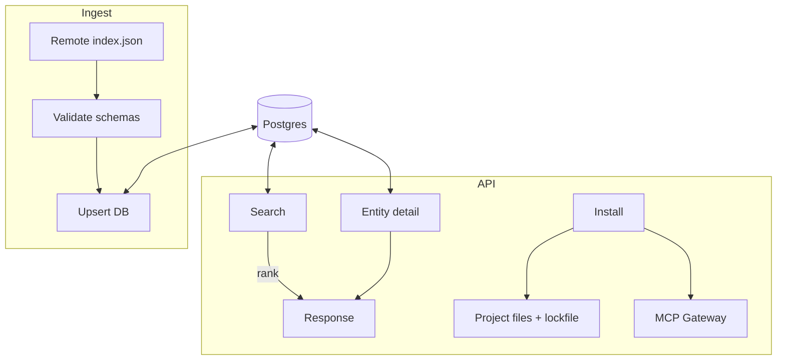

# Architecture

## Components

- **API** (FastAPI): search, entities, install, remotes, ingest trigger.
- **DB** (PostgreSQL): normalized entity metadata, artifacts, tags, capabilities.
- **Ingestor**: pulls `index.json`, validates manifests, upserts entities.
- **Installer**: executes artifact steps, writes adapters, updates lockfile, registers with MCP Gateway.
- **Scheduler**: periodic ingestion via APScheduler.

## Data model (high level)

- `entity` — `(uid, type, name, version, summary, description, capabilities[], frameworks[], providers[], source_url, created_at, updated_at, provenance)`
- `artifact` — `(entity_id, kind, uri, hash, size, install_hint)`
- `tag` & `entity_tag`, `capability` & `entity_capability` (many-to-many)
- optional `embedding_chunk` (when using vector search)

## Diagram

## Scaling
* Swap lexical backend to OpenSearch and vector backend to Milvus without changing the public API.
* Keep Matrix Hub stateless; scale horizontally.
