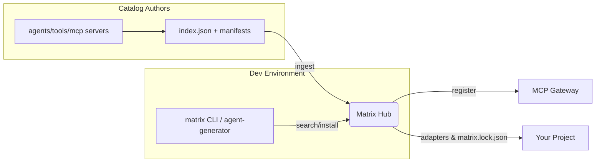

# Matrix Hub

**Matrix Hub** is a central **catalog & installer** for AI **agents**, **tools**, and **MCP servers**.  
It ingests manifests from remote catalogs (e.g., GitHub), powers **search** (lexical & semantic), computes and executes **install plans** (pip/uv, docker, git, zip), writes **adapters** into your project, and optionally registers assets with an **MCP Gateway**.

### Highlights

- **Reuse-first**: find existing agents/tools before generating new code.
- **Search**: lexical (pg_trgm), semantic (pgvector), **hybrid ranking**.
- **Install**: uv/pip, docker, git, zip with safe defaults & lockfile.
- **MCP Gateway**: register tools/servers using the gateway’s admin API.
- **Governance-ready**: schema validation, basic policy hooks.

---

## High-level architecture

API: FastAPI on `:7300`
DB: PostgreSQL (SQLite supported for local dev)
Scheduler: periodic ingestion of remote catalogs

### What’s in this release
* Core API: `/health`, `/catalog/search`, `/catalog/entities/{id}`, `/catalog/install`, `/catalog/remotes`, `/catalog/ingest`
* Ingestor: `index.json` pull + schema validation
* Installer: `pip/uv` + `docker` + `git` + `zip`
* MCP Gateway integration: tools & servers (gateway registration)
* Adapters: example templates (LangGraph node, WXO skill stub)
