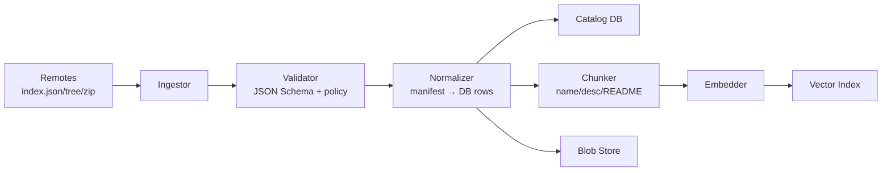

# Indexing Architecture

Matrix Hub ingests **manifests** (agents, tools, MCP servers) from remote catalogs (e.g., GitHub), validates them, normalizes metadata into a relational **Catalog DB**, optionally chunks & embeds long text, and updates a **Vector Index** plus a **Blob Store** for RAG.

## Goals

- **Reuse-first**: one canonical entry per `(type, id, version)`.
- **Idempotent**: re-ingesting the same content is safe.
- **Provable**: provenance stored (`remote@commit`, ETag, timestamps).
- **Composable**: lexical, vector, and RAG layers are pluggable.

## Data Flow (high level)

1. **Discover**: pull `index.json` (or walk repo ZIP/tree).
2. **Validate**: JSON Schema + optional signatures/SBOM checks.
3. **Normalize**: map to `entity`, `capabilities`, `artifacts`, `adapters`, `compatibility`.
4. **Persist**: upsert into DB; record provenance and checksums.
5. **Chunk & Embed** (optional): split long text → vectors → upsert vector index.
6. **Blob Store**: persist large text (READMEs, examples) for RAG retrieval.

## SLOs & Operational Notes

- **Freshness**: default ingest every 15 minutes (configurable).
- **Back-pressure**: batch size and rate limits to avoid API throttling.
- **Consistency**: write DB first, then vectors/blobs; retries are safe.
- **Observability**: structured logs; ingest counters; rejection reasons.
