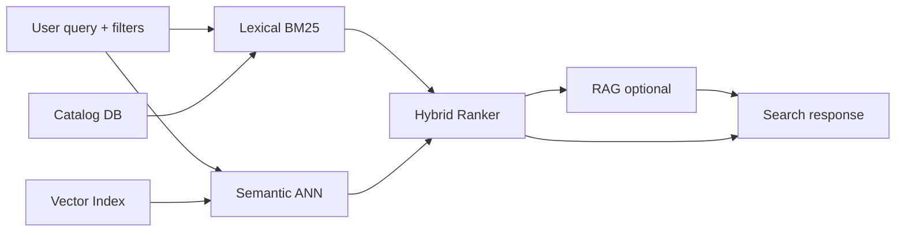

# Querying Architecture

Search blends **lexical** and **semantic** signals with quality & recency, then optionally performs RAG to produce a “fit reason”.

## Scoring

`score_final = w_sem*sem + w_lex*lex + w_q*quality + w_r*recency`  
Weights configured at runtime (e.g., `sem=0.6, lex=0.4` by default).

## Caching

- **ETag/Last-Modified** per query/filter tuple.
- Clients should respect `304 Not Modified`.

## Failure Modes

- If vector backend is unavailable, we fall back to lexical only.
- If lexical backend is unavailable, semantic only.
- Results include which modes contributed to the final score.
